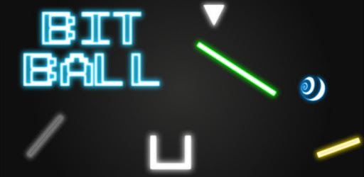
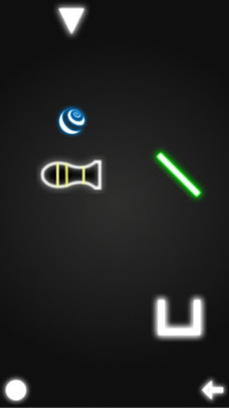
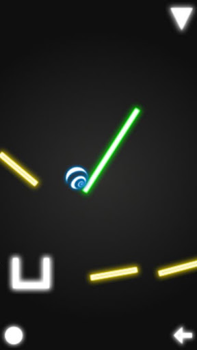
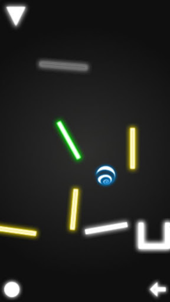
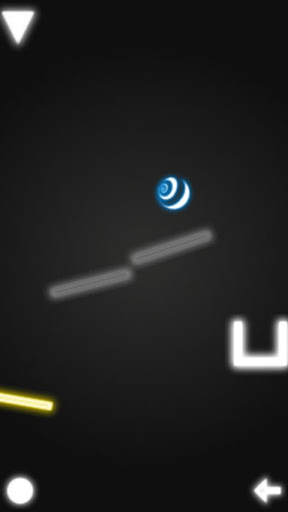
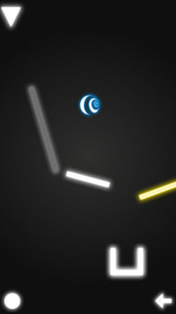

One of my first large programming projects, originally built in 2012 for my [high school](http://ethompson.org/) programming class.
Featured in the [Star Advertiser](http://www.staradvertiser.com/2012/07/31/hawaii-news/for-teenager-buds-of-life-bloom-without-boundaries/).

The app is a simple physics puzzle game, built for **Android** using **Corona SDK** and **Lua**.
You guide a ball to the goal in each level by timing its launch and tweaking the level, without directly controlling the ball.
The game contains 20 levels to play.

## Screenshots

#### Special platforms & objects
* Yellow platforms are bouncy
* Gray platforms rotate by themselves
* Green platforms are rotated by the player
* Cannons launch the ball forward once loaded
